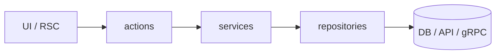

<div align="center">

# nextjs-feature-architecture

**Server-first Next.js for AI agents**

Feature slices · React Server Components · Server Actions · repositories & services

<br />

[](https://agentskills.io)
[](https://github.com/vercel-labs/skills)
[](LICENSE)

[Install](#install) · [Usage](#usage) · [Examples](#example-prompts) · [Layout](#repository-layout)

</div>

---

An [Agent Skills](https://agentskills.io) package that keeps Next.js App Router code **consistent and scalable**: vertical slices under `features/`, minimal client islands, and clear boundaries for integrated DB, REST, or Connect/gRPC backends.

Works with [Cursor](https://cursor.com), [Claude Code](https://code.claude.com), [Codex](https://developers.openai.com/codex), [Windsurf](https://windsurf.com), and [50+ agents](https://github.com/vercel-labs/skills#supported-agents) via the [Skills CLI](https://github.com/vercel-labs/skills).

## Install

```bash
npx skills add sameer2006-s/nextjs-feature-arch-skill -y
```

| Scope | Command |
|-------|---------|
| This project | `npx skills add sameer2006-s/nextjs-feature-arch-skill -y` |
| All projects | `npx skills add sameer2006-s/nextjs-feature-arch-skill -g -y` |
| Preview | `npx skills add sameer2006-s/nextjs-feature-arch-skill --list` |
| One agent | `npx skills add sameer2006-s/nextjs-feature-arch-skill -a <agent> -y` |

**Requires:** Node.js 18+ · a skills-capable agent

<details>
<summary>Clone and install locally</summary>

```bash
git clone https://github.com/sameer2006-s/nextjs-feature-arch-skill.git
cd nextjs-feature-arch-skill
npx skills add . -y
```

</details>

## Usage

1. Enable the skill **`nextjs-feature-architecture`** in your agent.
2. Mention it in your prompt with your task.
3. The agent outputs **topology → architecture → code** before implementing.

```text
Using nextjs-feature-architecture, add a comments feature with Prisma.
```

## What it enforces



| | |
|---|---|
| **Topologies** | Integrated · Separate-REST · Separate-gRPC · Hybrid |
| **Reads** | Server Component → service → repository / RPC |
| **Writes** | Client island → Server Action → service → repository / RPC |
| **Defaults** | Server Components first · validate at action boundary · client only at leaves |

## Backend modes

| Mode | When | Domain rules live in |
|------|------|----------------------|
| **Integrated** | Prisma / Drizzle in repo | Next.js `services/` |
| **Separate-REST** | External HTTP API | Backend |
| **Separate-gRPC** | Connect + protobuf | Backend |
| **Hybrid** | Mixed per feature | Per feature (one transport each) |

## Example prompts

**New feature · integrated**

```text
Using nextjs-feature-architecture, add a comments feature: list and create
comments on a post. We use Prisma.
```

**New feature · Connect/gRPC**

```text
Using nextjs-feature-architecture, add an item detail page with optional
client refresh. Connect RPC; proto package @acme/api.
```

**Refactor · client-heavy page**

```text
Using nextjs-feature-architecture, refactor app/dashboard/page.tsx — it uses
"use client" and useEffect fetch. Move to a server-first feature slice.
```

## Repository layout

```
nextjs-feature-arch-skill/
├── SKILL.md              ← agent entry (read first)
├── skill.json
├── rules/                architecture · folders · TypeScript
├── prompts/              generate & refactor prompts
├── examples/             slice · refactor · hybrid walkthroughs
└── docs/
    ├── topology.md
    ├── performance.md
    ├── eval/             trigger test queries (maintainers)
    └── snippets/         REST · gRPC · auth (on demand)
```

The agent loads **`SKILL.md` only** up front; snippet docs open when the task needs them — smaller context, faster runs.

## How it works

| Step | What happens |
|------|----------------|
| **Discovery** | Agent reads `name` + `description` from `SKILL.md` |
| **Activation** | Your prompt matches Next.js feature / refactor work |
| **Execution** | Topology detected → architecture doc → layered implementation |

## Contributing

Contributions welcome. Keep `SKILL.md` under ~150 lines; add detailed content under `docs/snippets/` and `examples/`.

| Resource | Link |
|----------|------|
| Changelog | [CHANGELOG.md](CHANGELOG.md) |
| Maintainer guide | [PUBLISHING.md](PUBLISHING.md) |
| License | [MIT](LICENSE) |
