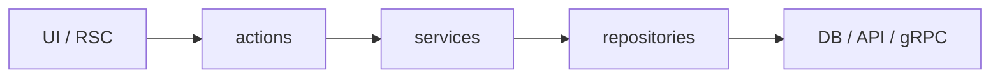

<div align="center">

# ⚡ Next.js Feature Architecture Skill

### Server-first vertical slices Skill for AI agents

<br />

<p>
  
  
  
</p>

<p>
  <a href="https://agentskills.io"></a>
  <a href="https://github.com/vercel-labs/skills"></a>
  <a href="LICENSE"></a>
</p>

<p>
  <strong>Feature slices</strong> · <strong>RSC</strong> · <strong>Zod</strong> · <strong>Server Actions</strong> · <strong>repositories &amp; services</strong>
</p>

<p>
  <a href="#install"><strong>Install</strong></a>
  &nbsp;·&nbsp;
  <a href="#usage"><strong>Usage</strong></a>
  &nbsp;·&nbsp;
  <a href="#example-prompts"><strong>Examples</strong></a>
  &nbsp;·&nbsp;
  <a href="#repository-layout"><strong>Layout</strong></a>
</p>

</div>

---

An [Agent Skills](https://agentskills.io) package that keeps Next.js App Router code **consistent and scalable**: vertical slices under `features/`, minimal client islands, and clear boundaries for integrated DB, REST, or Connect/gRPC backends.

Works with [Cursor](https://cursor.com), [Claude Code](https://code.claude.com), [Codex](https://developers.openai.com/codex), [Windsurf](https://windsurf.com), and [50+ agents](https://github.com/vercel-labs/skills#supported-agents) via the [Skills CLI](https://github.com/vercel-labs/skills).

## Install

```bash
npx skills add sameer2006-s/nextjs-feature-arch-skill --skill nextjs-feature-architecture
```

| Scope | Command |
|-------|---------|
| This project | `npx skills add sameer2006-s/nextjs-feature-arch-skill --skill nextjs-feature-architecture -y` |
| All projects | `npx skills add sameer2006-s/nextjs-feature-arch-skill --skill nextjs-feature-architecture -g -y` |
| Preview | `npx skills add sameer2006-s/nextjs-feature-arch-skill --list` |
| One agent | `npx skills add sameer2006-s/nextjs-feature-arch-skill --skill nextjs-feature-architecture -a <agent> -y` |

**Requires:** Node.js 18+ · a skills-capable agent

<details>
<summary><strong>Clone and install locally</strong></summary>

```bash
git clone https://github.com/sameer2006-s/nextjs-feature-arch-skill.git
cd nextjs-feature-arch-skill
npx skills add . --skill nextjs-feature-architecture -y
```

</details>

## Usage

1. Enable the skill **`nextjs-feature-architecture`** in your agent.
2. Mention it in your prompt with your task.
3. The agent outputs **topology → architecture → code** before implementing.

```text
Using nextjs-feature-architecture, add a comments feature with Prisma.
```

## What it enforces



| | |
|---|---|
| **Topologies** | Integrated · Separate-REST · Separate-gRPC · Hybrid |
| **Reads** | Server Component → service → repository / RPC |
| **Writes** | Client island → Server Action → service → repository / RPC |
| **Defaults** | Server Components first · Zod at actions · client only at leaves |

## Backend modes

| Mode | When | Domain rules live in |
|------|------|----------------------|
| **Integrated** | Prisma / Drizzle in repo | Next.js `services/` |
| **Separate-REST** | External HTTP API | Backend |
| **Separate-gRPC** | Connect + protobuf | Backend |
| **Hybrid** | Mixed per feature | Per feature (one transport each) |

## Example prompts

**New feature · integrated**

```text
Using nextjs-feature-architecture, add a comments feature: list and create
comments on a post. We use Prisma.
```

**New feature · Connect/gRPC**

```text
Using nextjs-feature-architecture, add an item detail page with optional
client refresh. Connect RPC; proto package @acme/api.
```

**Refactor · client-heavy page**

```text
Using nextjs-feature-architecture, refactor app/dashboard/page.tsx — it uses
"use client" and useEffect fetch. Move to a server-first feature slice.
```

## Repository layout

Multi-skill repo ([`skills/`](skills/)):

```
nextjs-feature-arch-skill/
├── README.md
├── LICENSE
└── skills/
    └── nextjs-feature-architecture/
        ├── SKILL.md          ← agent entry
        ├── skill.json
        ├── rules/            architecture · folders · TypeScript
        └── docs/
            ├── topology.md
            ├── performance.md
            └── snippets/     REST · gRPC · auth
```

The agent loads **`SKILL.md` only** up front; opens **`rules/`** and **`docs/`** when the task needs them. Add future skills as siblings under `skills/`.

## How it works

| Step | What happens |
|------|----------------|
| **Discovery** | Agent reads `name` + `description` from `SKILL.md` |
| **Activation** | Your prompt matches Next.js feature / refactor work |
| **Execution** | Topology detected → architecture doc → layered implementation |

## Contributing

Contributions welcome. Add skills under `skills/<name>/`; keep each `SKILL.md` under ~150 lines.

| Resource | Link |
|----------|------|
| Changelog | [CHANGELOG.md](CHANGELOG.md) |
| Maintainer guide | [PUBLISHING.md](PUBLISHING.md) |
| License | [MIT](LICENSE) |
